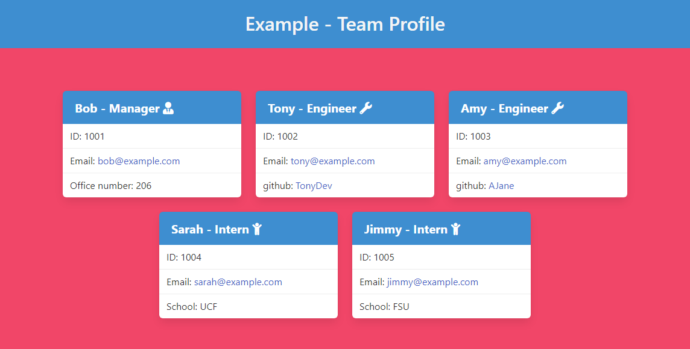

# Team Profile Generator

## Table of Contents

- [Team Profile Generator](#team-profile-generator)
  - [Table of Contents](#table-of-contents)
  - [Description](#description)
  - [Installation](#installation)
  - [Usage](#usage)
  - [Walkthrough Video](#walkthrough-video)
  - [Contributing](#contributing)
  - [Tests](#tests)
  - [License](#license)
  - [Questions](#questions)

## Description

A project for my bootcamp that lets you create a simple profile page for your development team. The program lets you add the team manager, and any number of engineers and interns that are on the team. It creates a card for each team member showing there name, role, employee ID, and email. Manager cards will also include there office number, while Engineer cards will include there github username, and intern cards will display there school.

## Installation

Download this repository from github. Then, in the terminal, `run npm install` while in this directory. You are then ready to use the generator.

## Usage

In the terminal, on this directory, run `node index.js`. You will then be prompted by a series of questions about the team. 

The first set will be for the team title, and the manager's information. 

Then, you will be given the option to either make an engineer card, an intern card, or to generate the file. Choosing the engineer or intern will prompt you for their information, and then it will give you the options again. 

Once generate is finally selected, the index.html file will be created with the provided information in the 'dist' folder (under the naming format `index_teamName.HTML`), and the program will end.

## Walkthrough Video

[Watch the Video Walkthrough Here.](https://drive.google.com/file/d/1BzY7lUBqO2Jx7szoqMBFsjtPtJr2HYFl/view?usp=sharing)

## Contributing

Anyone can fork this project and add features. However, all changes to the main section must be approved by the Admin.

## Tests

This program uses `jest` to run it's testing procedures. These tests are to ensure the employe information classes function properly. 

To run these test, simply run the command `npm test` in the terminal, on this directory.

## License

This project is licensed under a [MIT license](https://opensource.org/licenses/MIT).

## Questions

If you have any questions, please send them to [WRuback](https://github.com/WRuback) at wrubackdev@gmail.com with the heading "Team Profile Generator Question".
